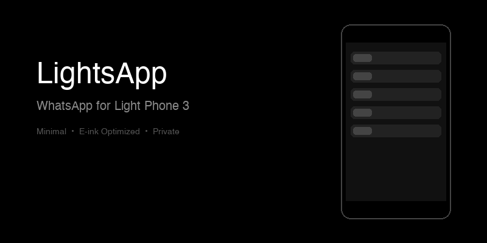
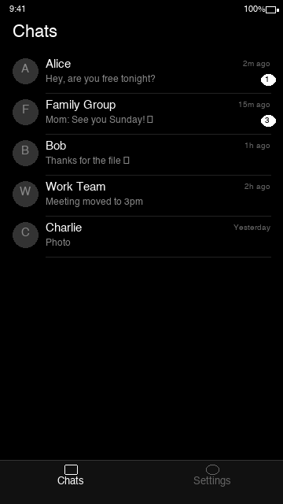
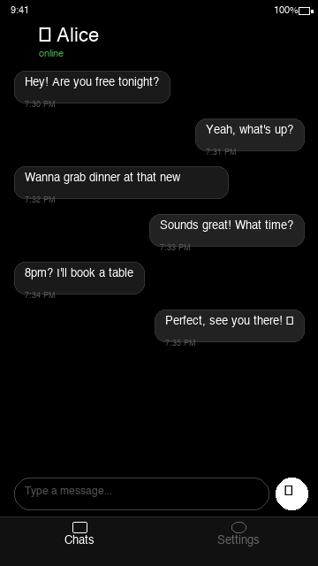
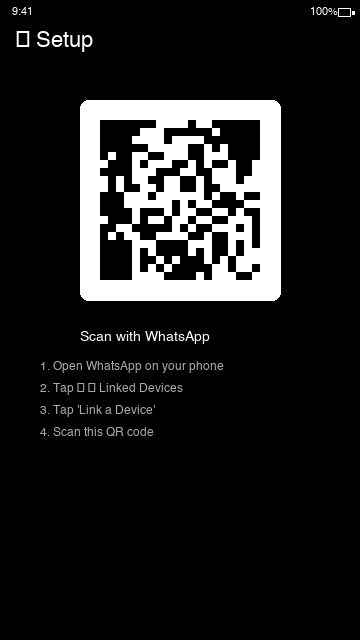
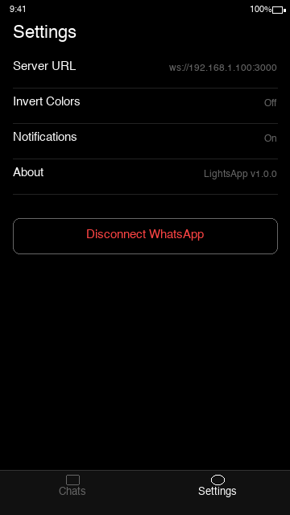

<p align="center">
  
</p>

<h1 align="center">LightsApp</h1>
<p align="center"><strong>WhatsApp client for Light Phone 3</strong></p>
<p align="center">Minimal • E-ink Optimized • Private</p>

<p align="center">
  
</p>

---

## Screenshots

<p align="center">
  
  &nbsp;&nbsp;
  
  &nbsp;&nbsp;
  
  &nbsp;&nbsp;
  
</p>

## Features

- 💬 **Full WhatsApp messaging** — Send and receive text, images, and voice messages
- 👥 **Group chats** — View and participate in group conversations
- 🔗 **QR code linking** — Connect to WhatsApp via QR scan (WhatsApp Web protocol)
- 🖤 **E-ink optimized** — High contrast black & white UI designed for the Light Phone 3 display
- ⚡ **Lightweight** — Minimal resource usage, fast on low-powered hardware
- 🔔 **Notifications** — Stay notified of new messages
- 🔄 **Invert colors** — Toggle between dark and light modes
- 🔒 **Private** — Messages stay on your device; connects through your own server

## How It Works

LightsApp connects to your own self-hosted bridge server (included in [`server/`](./server)) over WebSocket. The bridge speaks the WhatsApp Web multi-device protocol via [Baileys](https://github.com/WhiskeySockets/Baileys) — no Chromium, no third-party service like Beeper. Your messages and WhatsApp session never leave hardware you control. The app is a minimal UI optimized for the Light Phone 3's e-ink display.

**Architecture:**
```
Light Phone 3 (LightsApp)  ←WebSocket→  Bridge (server/, Baileys)  ←WA Web protocol→  WhatsApp
```

> **Why a bridge?** WhatsApp has no official API for personal accounts. Every personal client (WhatsApp Web, Beeper, etc.) registers as a *linked device*, which needs a persistent, authenticated connection that can't run on the phone alone. The bridge holds that session on an always-on machine you own (a Raspberry Pi, NAS, VPS, or spare laptop).

## Installation

### Download APK
1. Go to [Releases](https://github.com/KEZO555/LightsApp/releases) and download the latest `.apk`
2. Transfer to your Light Phone 3
3. Install and open

### Build from Source

```bash
# Install dependencies
bun install

# Build and run (dev)
bunx expo run:android

# Build release APK
eas build -p android --profile production --local
```

## Setup

### 1. Run the bridge server

On an always-on machine (Raspberry Pi, NAS, VPS, spare laptop):

```bash
cd server
bun install      # or: npm install
bun start        # starts the bridge on port 3001
```

The bridge stores its WhatsApp session in `server/auth_state/` (git-ignored). Keep it private — delete the folder to unpair.

### 2. Connect the app

1. Open LightsApp → **Settings → Bridge server** → enter the address, e.g. `ws://192.168.1.100:3001`
   (use `ws://` on a LAN, `wss://` behind a TLS-terminating proxy for remote access)
2. Go to **Settings → Link Device** and scan the QR with WhatsApp on your main phone
   (*WhatsApp → Settings → Linked Devices → Link a Device*)
3. Start chatting.

> **Voice notes:** the phone records standard audio and the bridge transcodes it to Ogg/Opus (what WhatsApp expects) using **ffmpeg**. Install ffmpeg on the server machine (`apt install ffmpeg`, `brew install ffmpeg`, etc.) for proper voice-note waveforms. Without ffmpeg the bridge falls back to sending the raw audio (best-effort). Text, photos, and incoming media/voice playback work regardless.

## Commands

```bash
bunx expo run:android       # Build and run (dev)
eas build -p android --profile production --local  # Build APK locally
bun run sync-version        # Sync version across files
bun run generate-icon       # Generate icon from app name
```

## CI / Releases

`.github/workflows/build.yml` builds a release APK with Gradle (`./gradlew
assembleRelease`) straight from the committed `android/` project and publishes
a GitHub Release. Trigger it manually from the **Actions** tab
(`workflow_dispatch`). No Expo account or secrets required; the release is
tagged with the version from `app.json` (debug-keystore signed — stable across
builds, fine for sideloading/Obtainium).

## Tech Stack

**App**
- [Expo](https://expo.dev) + [React Native](https://reactnative.dev)
- [Expo Router](https://docs.expo.dev/router/introduction/) for navigation
- WebSocket for real-time sync
- Built on the [light-template](https://github.com/vandamd/light-template) for LightOS

**Bridge** (`server/`)
- [Baileys](https://github.com/WhiskeySockets/Baileys) — WhatsApp Web multi-device protocol
- Express + `ws` for REST + WebSocket
- In-memory store for chats/messages, lazy media download with disk cache

## Detailed Docs

See [CLAUDE.md](./CLAUDE.md) for complete component reference, patterns, and examples.

---

<p align="center">Built for the <a href="https://www.thelightphone.com/">Light Phone 3</a></p>
